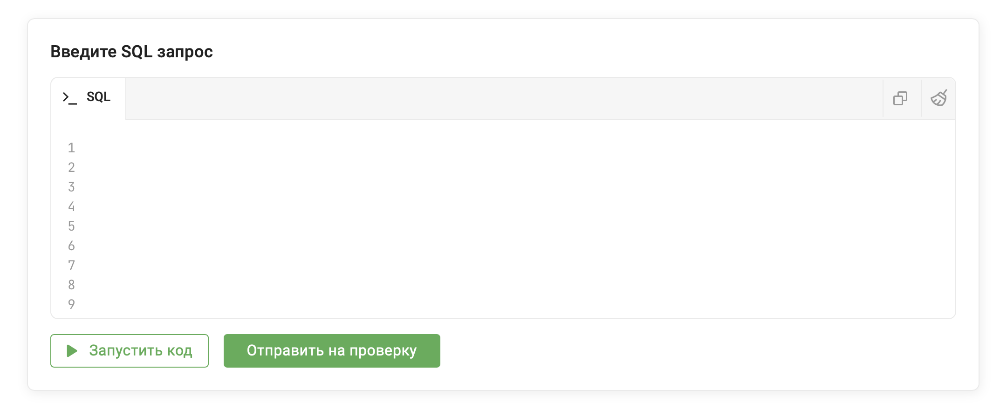

# Учебная база данных «Игроки»

В этой книге используется единая учебная база данных «Игроки».  

Все примеры и SQL-запросы основаны на таблице `players`.  
 
Если вы хотите не только читать книгу, но и выполнять все запросы самостоятельно, воспользуйтесь интерактивной SQL-песочницей, доступной в рамках курса «SQL Введение».

В песочнице вы сможете:  

* выполнять любые SQL-запросы;  
* изучать структуру таблицы;  
* экспериментировать с данными;  
* проверять собственные решения;  
* закреплять материал на практике.  



Доступ к курсу и SQL-песочнице:
https://stepik.org/a/290855


## Структура таблицы

| Поле | Тип данных | Описание |
|------|------------|----------|
| id | INT | Уникальный идентификатор игрока |
| nickname | VARCHAR(50) | Игровой ник |
| email | VARCHAR(100) | Электронная почта |
| city | VARCHAR(50) | Город проживания |
| country | VARCHAR(50) | Страна проживания |
| level | INT | Уровень персонажа |
| rating | INT | Игровой рейтинг |
| rank_title | VARCHAR(50) | Ранг игрока (Bronze, Silver, Gold, Platinum, Diamond, Master) |
| guild | VARCHAR(50) | Гильдия или клан игрока |
| wins | INT | Количество побед |
| losses | INT | Количество поражений |
| win_rate | DECIMAL(5,2) | Процент побед |
| last_login | DATE | Дата последнего входа |
| registration_date | DATE | Дата регистрации аккаунта |

## Пример записи

| id | nickname | city | level | rating | rank_title | guild |
|----|----------|------|-------|--------|------------|--------|
| 1 | AlphaKnight | Москва | 45 | 2100 | Gold | Грифоны Эрафии |

## Особенности данных

При работе с таблицей обратите внимание на несколько важных моментов:  

* Некоторые игроки не состоят в гильдиях. В поле `guild` для них хранится значение `NULL`.  
* В таблице представлены игроки разных уровней — от новичков до опытных пользователей.  
* Несколько игроков могут проживать в одном городе.  
* В одной гильдии может состоять сразу несколько игроков.  
* Даты регистрации и последних входов позволяют выполнять запросы по времени.  
* Таблица содержит как числовые, так и текстовые данные.  

## Работа с таблицей

Во всех главах этой книги запросы будут выполняться к одной и той же таблице:  

```sql
players
```

Перед началом изучения книги рекомендуется ознакомиться со структурой таблицы и понять назначение каждого столбца. Это поможет лучше понимать примеры и быстрее освоить SQL.