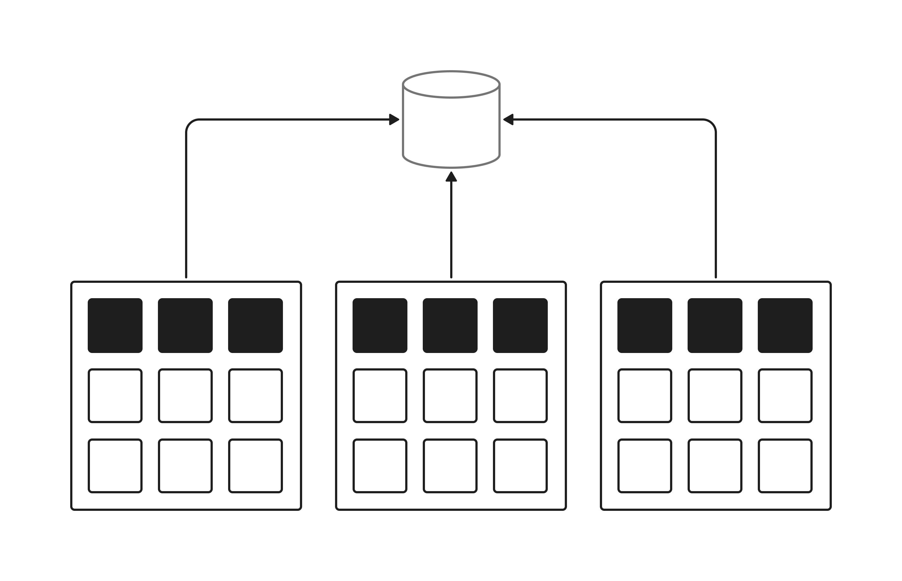
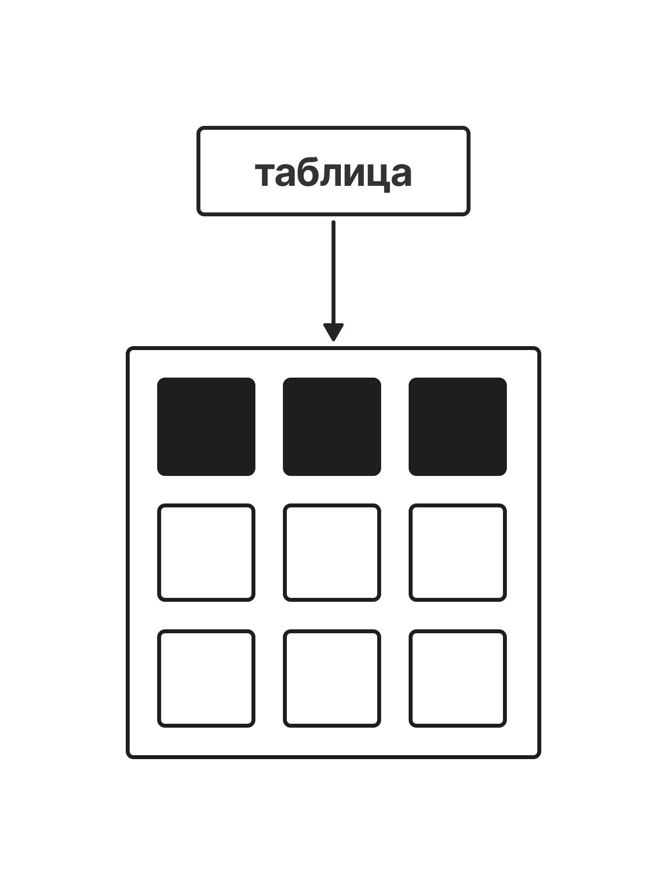
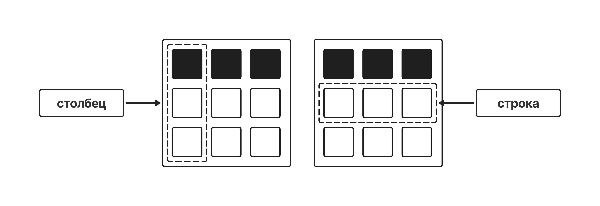
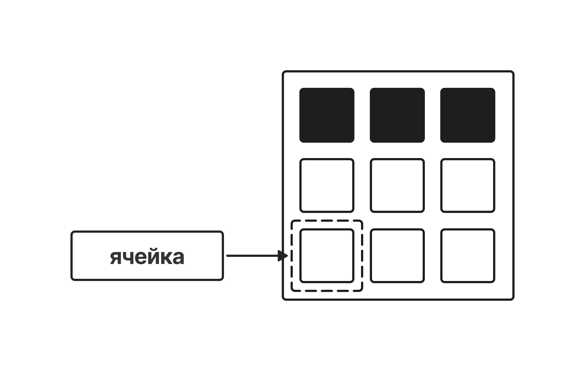
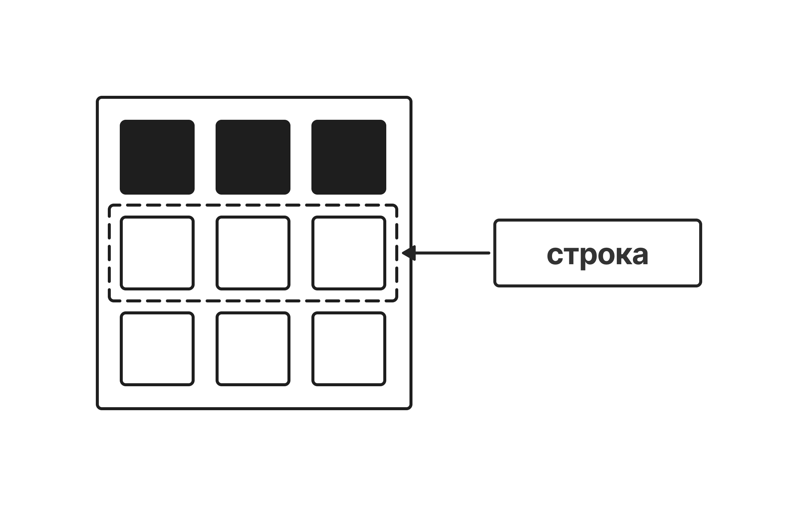
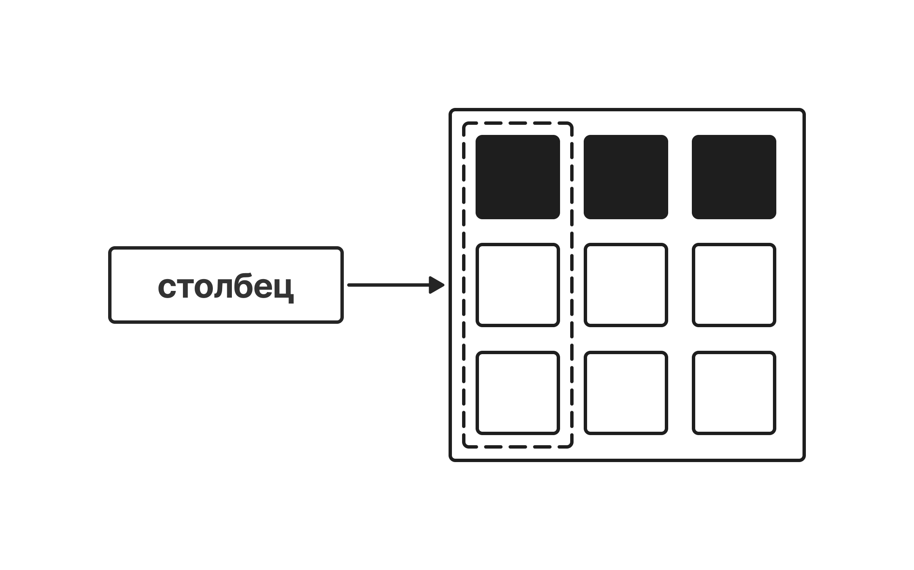

# Введение в SQL

**SQL** (**S**tructured **Q**uery **L**anguage) — декларативный язык программирования, является стандартным языком для работы с реляционными базами данных. Он используется для создания, изменения и управления структурой базы данных, а также для выполнения запросов к базе данных и получения данных из нее.

> **Декларативный язык программирования** — это язык программирования, в котором разработчик описывает **что нужно получить**, а не **как именно это сделать**.

**SQL** используется в большинстве современных **СУБД** (**С**истемы **У**правления **Б**азами **Д**анных) такие как **MySQL**, **Microsoft SQL Server**, **Oracle** и многие другие. 

 

### Краткая история SQL

Язык **SQL** появился после реляционной алгебры, и его прототип был разработан в конце 70-х годов в компании **IBM Research**. Он был реализован в первом прототипе реляционной **СУБД** фирмы IBM System R. С тех пор этот язык использовался многими коммерческими **СУБД** и был настолько популярен, что постепенно стал де-факто стандартным языком манипулирования данными в реляционных **СУБД**.

> **Реляционная алгебра** — замкнутая система операций над отношениями в реляционной модели данных.  
> Операции реляционной алгебры также называют реляционными операциями.

Первоначально язык назывался **SEQUEL** (**S**tructured **E**nglish **Q**uery **L**anguage), но потом слово "**English"** пропало из этого словосочетания. С одной стороны, **SQL** ориентирован на то, чтобы сделать запросы к реляционным базам данных удобными и понятными для пользователей. С другой стороны, его почти с самого начала называли "**полным языком баз данных**". 

**SQL** включает в себя: 

- средства для определения и управления схемой базы данных
- средства для определения ограничений целостности и триггеров
- средства для определения представлений БД
- средства для авторизации доступа к отношениям и их полям
- средства для определения структур физического уровня, поддерживающих эффективное выполнение запросов
- средства для определения точек сохранения транзакции и выполнения фиксации и откатов транзакций

# SQL Базы данных

**SQL Базы данных (SQL Databases)** — это специальные системы для надежного хранения, организации и быстрой обработки больших объемов информации. Чтобы находить нужные сведения, изменять их или удалять, они используют единый общепринятый язык — **SQL** (*Structured Query Language* или *Язык структурированных запросов*).

В рамках книги мы будем изучать все команды и концепции на примере **учебной базы данных «Игроки»**. В ней собрана подробная статистика о киберспортсменах, их рейтингах, гильдиях и результатах матчей. Это поможет вам сразу применять теорию на понятных и практических игровых сценариях!

Вся информация о наших игроках и их достижениях хранится в **реляционных** базах данных. Слово «реляционный» происходит от английского *relation* (отношение, связь). Это значит, что данные внутри системы организованы в виде простых и понятных **таблиц**, которые при необходимости можно связывать друг с другом.

 

## Как устроена таблица данных?

Структура реляционной таблицы очень похожа на привычные нам таблицы в Excel или Google Документах. Она строго состоит из строк и столбцов:

- **Столбцы (Поля)** — определяют, какие именно характеристики объекта мы записываем. Каждый столбец имеет свое имя и определенный тип данных (текст, целое число, дробное число и т.д.). В нашей таблице `players` это такие поля, как `nickname`, `level`, `rating` или `registration_date`.  
- **Строки (Записи)** — это конкретные примеры объектов. В нашем случае каждая строка — это анкета отдельного киберспортсмена со всеми его игровыми показателями.

Использование баз данных вместо обычных текстовых блокнотов или разрозненных файлов дает разработчику (и аналитику!) колоссальные преимущества:

- **Универсальный язык запросов.**  
  С помощью SQL вы можете написать один простой запрос и например мгновенно отфильтровать 50 игроков по нужному вам уровню, проценту побед или принадлежности к определенной гильдии.  
- **Целостность данных и отсутствие дублирования.**  
  Базы данных позволяют связывать таблицы между собой. Например, можно вынести детальное описание игровых кланов в отдельную таблицу, избегая повторения одной и той же информации о гильдии для каждого участника.  
- **Быстродействие.**   
  Благодаря созданию специальных «указателей» (индексов), поиск нужного игрока среди множества записей в базе данных занимает доли секунды.  
- **Безопасность и контроль.**  
  База данных четко контролирует, кто имеет право просматривать конфиденциальную информацию , а кто — изменять.  

## Что такое СУБД?

Сама по себе база данных — это просто упорядоченное хранилище файлов на диске.  
Чтобы мы могли работать с ней с помощью языка SQL, нам нужна специальная программа.

**СУБД (Система Управления Базами Данных)** или на английском **RDBMS** (*Relational Database Management System*) — это программное обеспечение, которое позволяет создавать базы данных, наполнять их, защищать и выполнять к ним SQL-запросы.

Существует множество популярных СУБД. Они могут немного отличаться интерфейсом и дополнительными возможностями, но все они используют и понимают стандартный язык SQL. К самым известным относятся:

- **MySQL** (именно её мы будем использовать в книге!)
- PostgreSQL
- SQLite
- Oracle
- Microsoft SQL Server

# Что такое таблица в базе данных?

**Таблица (table)** в SQL — это основной контейнер для хранения информации в реляционной базе данных.  
Представьте её как продвинутую и очень строгую таблицу в Excel или Google Таблицах.

Каждая таблица состоит из **столбцов** и **строк**:

- **Столбец (поле / column)** — определяет, *какой именно тип информации* хранится.   
  Например, никнейм, уровень персонажа или дата его регистрации в игре.   
  У каждого столбца есть свое фиксированное имя и строго определенный тип данных.  
- **Строка (запись / row)** — это *один конкретный объект* в базе данных.  
  Сколько строк в таблице — столько реальных геймеров со всей их статистикой мы в неё записали.

### Разбираем на примере таблицы `players`

В нашей книге мы работаем с таблицей `players`. Она создана для того, чтобы собирать, обновлять и анализировать подробную статистику участников игрового сообщества, их успехи, гильдии и турнирные ранги.

Давайте посмотрим, как устроена часть этой таблицы изнутри (первые три записи):

| id | nickname      | city            | level | rating | rank\_title | guild                 |
|----|---------------|-----------------|-------|--------|-------------|-----------------------|
| 1  | AlphaKnight   | Москва          | 45    | 2100   | Gold        | Грифоны Эрафии        |
| 2  | CatQueen      | Санкт-Петербург | 12    | 850    | Bronze      | NULL                  |
| 3  | ThunderStrike | Новосибирск     | 89    | 3450   | Diamond     | Черные Драконы Нигона |

### Как на это смотрит SQL-аналитик:

1. **Каждый столбец задает характеристику игрока.**   
   Столбец `nickname` всегда хранит текст (игровое имя), а `rating` или `level` — строго целое число (показатели прогресса).  
2. **Каждая строка — это один конкретный игрок со всеми его условиями.**   
   Например, строка **№1** целиком описывает геймера с ником *AlphaKnight*: он живет в Москве, достиг 45-го уровня, имеет 2100 очков рейтинга, носит звание «Gold» и состоит в клане «Грифоны Эрафии». А у игрока *CatQueen* под номером **2** в поле `guild`указано значение *NULL* — это значит, что на данный момент она не состоит ни в одной игровой гильдии.

 

**Важное правило:**   
В реляционных таблицах изначальный порядок строк не имеет принципиального значения. База данных может выдать их при запросе в любом случайном порядке, пока мы сами жестко не попросим её отсортировать данные. Но об этом — в следующих уроках!

# Что такое ячейка данных?

**Ячейка (item / cell)** в базе данных — это самый маленький, неделимый элемент данных, который может быть сохранен в таблице. Она находится на **пересечении одной конкретной строки и одного конкретного столбца**.

Каждая ячейка содержит только **одно значение** и строго подчиняется правилам своего столбца:

- Если столбец предназначен для текста (например, игровые никнеймы), в его ячейку нельзя записать дату.
- Если столбец хранит целые числа (например, количество побед), там не может оказаться текст или дробный процент.

### Разбираем на примере игрока ThunderStrike

Давайте посмотрим на одну конкретную запись из нашей игровой базы данных `players`, которая описывает опытного киберспортсмена под ником *ThunderStrike*:

| **id** | **nickname**  | **city**    | **level** | **rating** | **rank\_title** | **guild**             | **wins** | **win\_rate** |
|--------|---------------|-------------|-----------|------------|-----------------|-----------------------|----------|---------------|
| **3**  | ThunderStrike | Новосибирск | 89        | 3450       | Diamond         | Черные Драконы Нигона | 540      | 56.84         |

В этой строке каждая отдельная ячейка несет свой смысл и имеет свой строго определенный тип данных:

- В ячейке столбца `nickname` хранится **строка текста** — `'ThunderStrike'`.
- В ячейке столбца `city` хранится **строка текста** — `'Новосибирск'`.
- В ячейке столбца `level` хранится **целое число** — `89` (текущий игровой уровень).
- В ячейке столбца `rating` хранится **целое число** — `3450` (очки соревновательного рейтинга).
- В ячейке столбца `win_rate` хранится **дробное число** — `56.84` (процент успешных матчей).

 
**Обратите внимание:**   
В SQL-базах данных пустая ячейка — это тоже значение. Если игрок только зарегистрировался, еще не успел вступить ни в один игровой клан или не получил турнирное звание, в такую ячейку временно записывается специальное значение **NULL** (обозначающее отсутствие данных). Например, у игрока *CatQueen* (id 2) в ячейке столбца `guild` стоит именно *NULL*.

| id | nickname | city            | level | rating | rank\_title | guild |
|----|----------|-----------------|-------|--------|-------------|-------|
| 2  | CatQueen | Санкт-Петербург | 12    | 850    | Bronze      | NULL  |

# Что такое запись (строка) в таблице?

**Запись (record)** или **строка (row)** в SQL-базе данных — это горизонтальный срез таблицы, который содержит все данные для одной конкретной единицы информации. В реляционных базах данных каждая строка описывает один самостоятельный и целостный объект.

В нашей таблице `players` каждая отдельная строка представляет собой **одного конкретного игрока** со своим набором уникальных характеристик (столбцов): `id`, `nickname`, `email`, `city`, `level`, `rating` и так далее. Сколько геймеров зарегистрировано в нашей игре — столько строк и будет в таблице.

### Разбираем структуру строки на примере игрока AlphaKnight

Давайте выделим из нашей базы данных самую первую строку и посмотрим, из каких полей она состоит.  

В этой строке собраны данные, которые относятся **строго к одному пользователю** и описывают его текущий игровой профиль:

- **id:** `1` (уникальный номер этой записи в системе).
- **nickname:** `AlphaKnight` (уникальное имя в игре).
- **email:** `alpha_knight@yandex.ru` (контактная почта).
- **city:** `Москва` (город проживания).
- **country:** `Россия` (страна игрока, установленная по умолчанию).
- **level:** `45` (текущий уровень персонажа).
- **rating:** `2100` (очки соревновательного рейтинга).
- **rank\_title:** `Gold` (текущее турнирное звание).
- **guild:** `Грифоны Эрафии` (игровой клан, в котором состоит пользователь).
- **wins:** `120` (количество побед в матчах).
- **losses:** `80` (количество поражений).
- **win\_rate:** `60.00` (процент успешных игр).
- **last\_login:** `2026-06-20` (дата последнего посещения игры).
- **registration\_date:** `2025-01-15` (день, когда игрок создал аккаунт).

**Ключевое правило баз данных:**   
Все данные внутри одной строки жестко связаны между собой. Мы не можем случайно перемешать количество побед игрока *AlphaKnight* с никнеймом или почтой игрока *CatQueen* — СУБД строго следит за целостностью и неделимостью каждой строки.

# Что такое столбец (поле) в таблице?

**Столбец (column)** в SQL базе данных — это вертикальный срез таблицы, который используется для хранения данных одного строго определенного типа.

Каждый столбец в таблице обязательно имеет:

1. **Свое уникальное имя** (например, `nickname` или `rating`).
2. **Тип данных** — ограничение, которое указывает базе, что именно здесь можно хранить (текст, целое число, дробь или дату).

**Лайфхак для новичков:**   
Термины **«столбец»** и **«поле»** в SQL используются как синонимы. Это абсолютно одно и то же.

### Разбираем вертикальный срез на примере столбца `city`

Давай посмотрим, как выглядит отдельный столбец `city` из нашей таблицы `players`.  
Он имеет тип данных `VARCHAR` (строка текста) и хранит исключительно названия городов проживания наших игроков:

| **city**        |
|-----------------|
| Москва          |
| Санкт-Петербург |
| Новосибирск     |
| Екатеринбург    |
| Омск            |
| Казань          |
| Нижний Новгород |

## Зачем столбцам нужны типы данных?

Тип данных защищает таблицу от хаоса и ошибок.  
Давай посмотрим на три разных столбца из нашей базы `players`:

| **nickname** | **rating** | **registration\_date** |
|--------------|------------|------------------------|

- **nickname** (Тип: Текст / `VARCHAR`) — хранит слова.  
  База данных понимает, что эти значения можно переводить в верхний регистр, проверять на длину или искать в них определенные буквы.
- **rating** (Тип: Целое число / `INT`) — хранит только числа без запятой.  
  База знает, что их можно складывать, находить среднее соревновательное значение или искать игроков, у которых рейтинг выше 2000. Сюда физически нельзя записать слово "Профи".
- **registration\_date** (Тип: Дата / `DATE`) — хранит строго даты в формате `ГГГГ-ММ-ДД`.  
  База понимает, какой пользователь зарегистрировался в игре раньше, а какой позже.

Именно благодаря столбцам мы сможем говорить с базой данных на языке аналитики: например, попросить её *«посчитать среднее значение по столбцу Процент побед (`win_rate`)»* или *«оставить только те строки, где в столбце Звание (`rank_title`) написано 'Gold'»*.