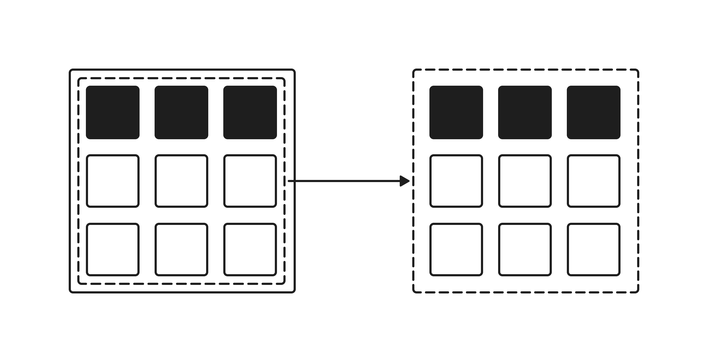
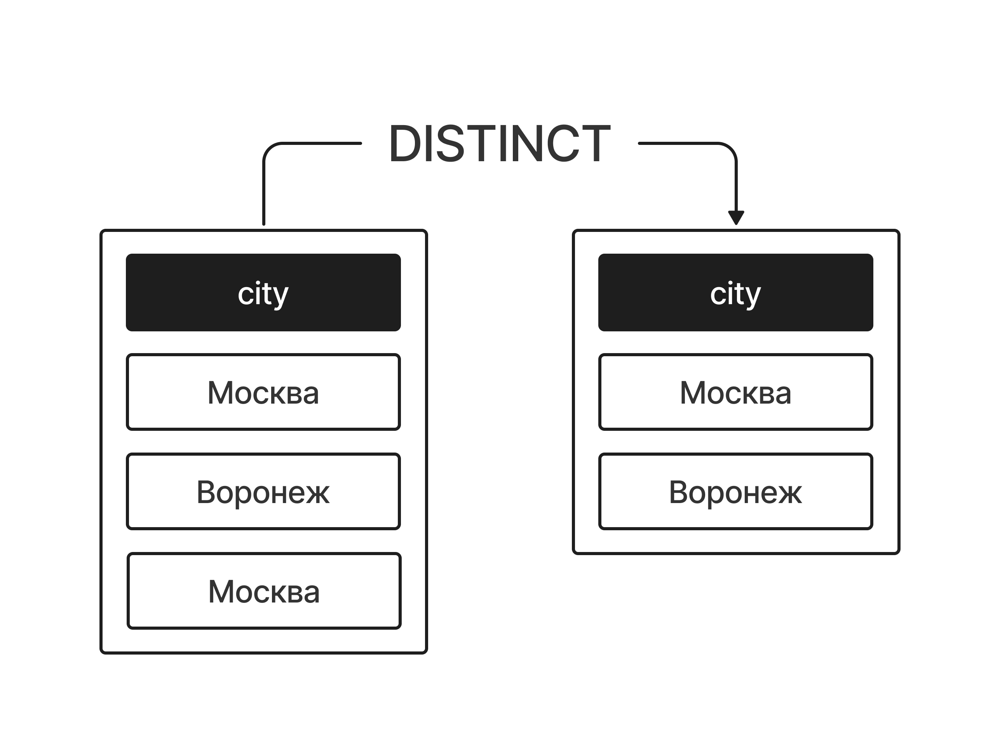

# Выборка данных (Оператор SELECT)

Чтобы заставить базу данных показать нам информацию, мы пишем ей специальную команду — **запрос (query)**.  
Главный инструмент для этого в SQL — ключевое слово  **`SELECT`**  (выбрать).



С помощью `SELECT` мы можем забрать из таблицы либо вообще все данные, либо только нужные нам столбцы, либо отфильтровать строки по какому-то условию.

## Выбираем ВСЕ столбцы из таблицы

Представь, что тебе нужно просто посмотреть на всю нашу таблицу целиком, чтобы изучить зарегистрированных игроков. Чтобы не перечислять вручную все 14 названий столбцов, в SQL используют знак **«звёздочка» (`*`)**. Она означает «покажи мне все поля, которые есть в таблице».


**Наш запрос:**

```sql
SELECT * FROM players;
```

**Результат:**

База данных выведет полную таблицу со всеми 50 строками и всеми столбцами (`id`, `nickname`, `email`, `city`, `country`, `level`, `rating`, `rank_title`, `guild`, `wins`, `losses`, `win_rate`, `last_login`, `registration_date`).

## Выбираем только ОПРЕДЕЛЕННЫЕ столбцы

Чаще всего аналитику или разработчику не нужен весь массив данных.

Например, твоя задача — составить простой дашборд со списком никнеймов игроков, их текущим уровнем и рейтингом, а почта, города и даты входа сейчас не важны.


Чтобы убрать лишний «шум», мы перечисляем нужные столбцы через запятую сразу после слова `SELECT`:

**Наш запрос:**

```sql
SELECT nickname, 
       level, 
       rating 
FROM players;
```

SQL вернет аккуратную «вырезку» из таблицы.

В ней по-прежнему будут все 50 игроков, но отображаемая информация станет компактной.

**Результат (срез, первые 10 строк):**

| nickname      | level | rating |
|---------------|-------|--------|
| AlphaKnight   | 45    | 2100   |
| CatQueen      | 12    | 850    |
| ThunderStrike | 89    | 3450   |
| AliceFox      | 31    | 1500   |
| MaxDrive      | 55    | 2400   |
| NightWolf     | 73    | 2900   |
| StarDust      | 22    | 1150   |
| SteelKnight   | 61    | 2650   |
| CyberKing     | 40    | 1950   |
| PhoenixRF     | 50    | 2200   |

# Избавляемся от дубликатов (Ключевое слово DISTINCT)

Когда ты работаешь с большими базами данных, значения в столбцах неизбежно повторяются.  
Например, в нашей таблице `players` находится 50 геймеров, но крупных городов или игровых рангов в системе гораздо меньше.

Если мы сделаем обычный запрос `SELECT city FROM players;`, база данных честно выведет нам 50 строчек, где слова «Москва», «Санкт-Петербург» или «Казань» повторятся многократно. Читать такой отчет крайне неудобно.



Чтобы убрать этот «информационный шум» и оставить только уникальные значения, в SQL используется ключевое слово  **`DISTINCT`**  (отдельный / уникальный).

## Задача: Узнать список всех городов, в которых живут наши игроки

Мы хотим получить чистый список городов без повторений, чтобы понимать географию нашей игровой базы. Для этого мы ставим слово `DISTINCT` строго **после** `SELECT`, но **перед** именем столбца:

**Наш запрос:**

```sql
SELECT DISTINCT city 
FROM players;
```

**Как это работает:**

Упрощённо можно представить, что база данных просматривает все значения столбца и оставляет только уникальные. Поэтому в результате каждая город появляется только один раз.

**Результат (**уникальные города из 50 строк таблицы, **срез, первые 10 строк):**

| city            |
|-----------------|
| Москва          |
| Санкт-Петербург |
| Новосибирск     |
| Екатеринбург    |
| Омск            |
| Казань          |
| Нижний Новгород |
| Челябинск       |
| Самара          |
| Ростов-на-Дону  |

## Полезный лайфхак: DISTINCT для нескольких столбцов

Если указать несколько столбцов через запятую после `DISTINCT`, например:

```sql
SELECT DISTINCT rank_title, guild 
FROM players;
```

SQL будет искать уникальные комбинации значений в этих столбцах.

Мы увидим, какие сочетания званий и кланов встречаются в базе данных, но каждая комбинация будет показана только один раз.

**Например:**

- Gold — Грифоны Эрафии
- Platinum — Черные Драконы Нигона
- Gold — Золотые Единороги Авли

Если одна и та же пара значений встречается в таблице несколько раз, в результат она попадёт только один раз.

**Запомни правило:**   
ключевое слово `DISTINCT` всегда пишется сразу после `SELECT`. Оно проверяет уникальность всей комбинации выбранных столбцов, а не каждого столбца по отдельности.

# Ограничение и сдвиг вывода (LIMIT и OFFSET)

Представь, что в интерфейсе нашей игры открывается вкладка «Рейтинг лидеров». В базе данных `players` хранится большое количество пользователей. Если вывалить на экран геймера сразу все 50 (или тысячи!) строк, интерфейс будет долго грузиться, а на экране начнется каша.


Чтобы управлять объёмом выдачи, в SQL используются два мощных инструмента:

- **LIMIT** — указывает *максимальное количество строк*, которое нужно вернуть.
- **OFFSET** — указывает, *сколько строк нужно пропустить* с самого начала, прежде чем выводить результат.

## Вариант 1. Ограничиваем вывод с помощью LIMIT

Допустим, тебе нужно сделать небольшой виджет для главного меню игры: **«ТОП-3 игрока по соревновательному рейтингу»**. Нам не нужна вся база, нам нужны только первые три строки после сортировки.

**Наш запрос:**

```sql
SELECT nickname, level, rating
FROM players
ORDER BY rating DESC
LIMIT 3;
```

**Результат:**

База данных сначала выстроит игроков по рейтингу от самого высокого к самому низкому, а затем оставит только три верхние позиции этого списка.

| nickname      | level | rating |
|---------------|-------|--------|
| AdmiralB      | 91    | 3600   |
| ThunderStrike | 89    | 3450   |
| SiberianLion  | 82    | 3200   |

## Вариант 2. Постраничная навигация с помощью OFFSET

А теперь классическая задача из веб-разработки и геймдева: нужно сделать постраничный вывод рейтинга (пагинацию). На первой странице таблицы лидеров мы показали первые 3 игрока. А как показать вторую страницу (места с 4 по 6)? Нам нужно *пропустить* первые 3 строки и забрать *следующие 3*.

Для этого мы добавляем  **`OFFSET 3`** :

**Наш запрос:**

```sql
SELECT nickname, level, rating
FROM players
ORDER BY rating DESC
LIMIT 3 OFFSET 3;
```

**Результат:**

SQL взял тот же список, перешагнул через лидеров (*ThunderStrike*, *AlexMega* и *GhostRider*) и выдал следующие по порядку три строки:

| nickname      | level | rating |
|---------------|-------|--------|
| MountainQueen | 77    | 3100   |
| AltaiShaman   | 72    | 2980   |
| ForestHunter  | 70    | 2950   |

## Вариант 3. Совмещение фильтрации WHERE и LIMIT

Ты можешь легко комбинировать ограничение строк с фильтрацией.

Например, задача: **«Покажи мне 2 любых опытных игроков из города Москва, у которых уровень персонажа уже больше 40»**.

**Наш запрос:**

```sql
SELECT nickname, city, level
FROM players
WHERE city = 'Москва' AND level > 40
LIMIT 2;
```

**Результат:**

База данных сначала отфильтрует таблицу по условию `WHERE`, оставив только москвичей старше 40 уровня, а из получившегося списка вернет только первые две строки:

| **nickname** | **city** | **level** |
|--------------|----------|-----------|
| AlphaKnight  | Москва   | 45        |
| MoscowGuy    | Москва   | 42        |

## Спойлер для внимательных читателей

В примерах выше мы использовали команды `WHERE` (для фильтрации игроков по условиям) и `ORDER BY` (для сортировки по рейтингу). Не переживай, если они пока кажутся тебе сложными — в этом уроке они нужны только для того, чтобы показать красоту и пользу работы `LIMIT`.

Настоящую магию сортировки (`ORDER BY`) и точечной фильтрации данных (`WHERE`) мы во всех деталях разберем в следующих уроках. Всему свое время!

**Строгий порядок команд в MySQL:**   
Запомни, как правильно выстраивать цепочку операторов, иначе база данных выдаст синтаксическую ошибку:

