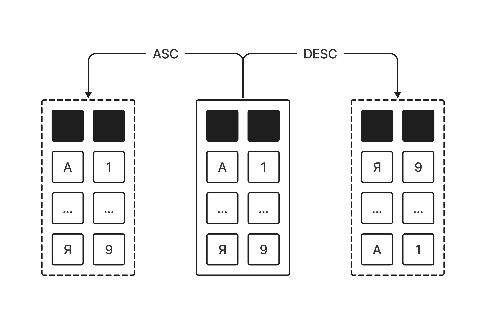

# Сортировка данных (Оператор ORDER BY)

Когда мы просто выбираем данные из таблицы, MySQL может возвращать строки в произвольном порядке.  
Иногда это может совпадать с порядком добавления записей, но это не гарантируется.

Но разработчику, который анализирует статистику, такой порядок обычно не подходит. Например, ему нужно отсортировать игроков: например, по уровню, рейтингу или проценту побед.

За управление порядком строк в SQL отвечает оператор `ORDER BY` — оператор сортировки результатов запроса.

## Синтаксис и главные правила

Мы указываем `ORDER BY` в самом конце запроса (но перед `LIMIT` и `OFFSET`, если они есть) и пишем имя столбца, по которому хотим навести порядок.



**У сортировки есть два направления:**

- **ASC** (от *ascending*) — по возрастанию (от меньшего к большему, от А до Я).  
  Используется по умолчанию, если вообще ничего не писать после имени поля.
- **DESC** (от *descending*) — по убыванию (от большего к меньшему, от Я до А).

## Сортировка по возрастанию

Давай поможем разработчику найти игроков с самым низким уровнем, чтобы отправить им предложение пройти обучающий квест. Отсортируем их по столбцу `level` от меньшего к большему.

**Наш запрос:**

```sql
SELECT nickname, city, level
FROM players
ORDER BY level ASC;
```

*Так как `ASC` — это режим по умолчанию, мы могли бы просто написать `ORDER BY level`. Результат был бы точно таким же.*

**Результат (срез, первые 5 строк):**

База данных выставит на первые строчки пользователей с минимальным игровым прогрессом:

| **nickname** | **city**        | **level** |
|--------------|-----------------|-----------|
| PrinceX      | Владимир        | 5         |
| KazanCat     | Казань          | 8         |
| CatQueen     | Санкт-Петербург | 12        |
| LipetskBoy   | Липецк          | 14        |
| NorthLight   | Тула            | 15        |

## Сортировка по убыванию

Например, нам нужно составить актуальный список лидеров для турнирной таблицы. Уровень персонажа сейчас не важен, критически важны очки соревновательного рейтинга (`rating`). Сортируем по убыванию (**DESC**).

**Наш запрос:**

```sql
SELECT nickname, rank_title, rating
FROM players
ORDER BY rating DESC;
```

**Результат (срез, первые 5 строк):**

Наверху окажутся киберспортсмены с высокими показателями рейтинга:

| **nickname**  | **rank\_title** | **rating** |
|---------------|-----------------|------------|
| AdmiralB      | Master          | 3600       |
| ThunderStrike | Diamond         | 3450       |
| SiberianLion  | Diamond         | 3200       |
| MountainQueen | Diamond         | 3100       |
| AltaiShaman   | Platinum        | 2980       |

## Многоуровневая сортировка (Сортируем по нескольким столбцам)

А что если мы хотим сгруппировать игроков по городам (в алфавитном порядке), а уже **внутри каждого города** выявить лидеров по соревновательному рейтингу (от большего к меньшему)?

В SQL можно указать несколько столбцов через запятую. База данных начнет сортировать по первому, а если значения совпадут — применит правило для второго.

**Наш запрос:**

```sql
SELECT city, nickname, rating
FROM players
ORDER BY city ASC, 
         rating DESC;
```

**Результат (пример среза по городам, первые 5 строк):**

SQL сначала отсортирует города по алфавиту. Но так как игроков из одного города в базе может быть много, внутри блока каждого города пользователи выстроятся по рейтингу вниз:

| city        | nickname    | rating |
|-------------|-------------|--------|
| Астрахань   | Fisherman   | 1300   |
| Барнаул     | AltaiShaman | 2980   |
| Брянск      | RangerX     | 2350   |
| Владивосток | AmurTiger   | 2500   |
| Владимир    | PrinceX     | 500    |

**Как это читать:**   
База данных сначала рассматривает строки: «у меня несколько игроков из Воронежа — город одинаковый, значит смотрю на второй критерий: `rating DESC`. Поэтому более сильные игроки оказываются выше».  
Затем начинается следующий город, и правило сортировки по рейтингу снова применяется внутри новой группы.