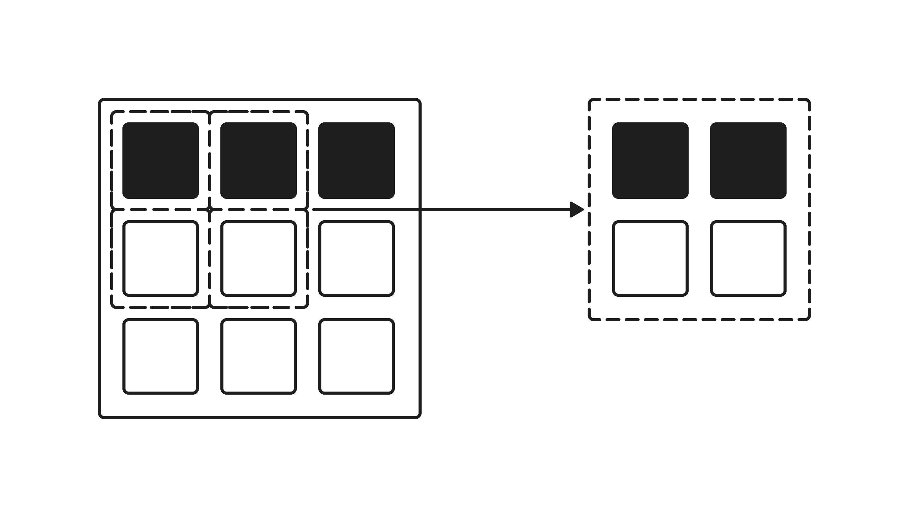

# Фильтрация данных (Оператор WHERE)

Фильтрация данных в SQL позволяет выбрать только те строки из таблицы, которые удовлетворяют определенным условиям. Для отсечения лишних записей используется оператор  **`WHERE`** .



В нашей таблице `players` хранится 50 игроков со всей России. Давайте разберем, как с помощью фильтрации находить среди них нужных пользователей.

## Примеры базовой фильтрации

Например, если мы хотим выбрать игроков, которые зарегистрировались в игре после 1 января 2025 года, мы пишем следующий запрос:

```sql
SELECT nickname, level, registration_date
FROM players
WHERE registration_date > '2025-01-15';
```

**Результат (срез, первые 5 строк):**

| nickname    | level | registration\_date |
|-------------|-------|--------------------|
| CatQueen    | 12    | 2026-05-10         |
| AliceFox    | 31    | 2025-11-03         |
| MaxDrive    | 55    | 2025-03-14         |
| StarDust    | 22    | 2026-02-18         |
| SteelKnight | 61    | 2025-05-20         |

Если мы хотим выбрать только тех опытных игроков, у которых уровень строго выше 40, а в поле звания (`rank_title`) указано 'Gold', запрос будет выглядеть так:

```sql
SELECT nickname, level, rank_title
FROM players
WHERE level > 40
  AND rank_title = 'Gold';
```

**Результат:**

| nickname     | level | rank\_title |
|--------------|-------|-------------|
| AlphaKnight  | 45    | Gold        |
| MaxDrive     | 55    | Gold        |
| PhoenixRF    | 50    | Gold        |
| AmurTiger    | 58    | Gold        |
| SeaWolf      | 48    | Gold        |
| StormBringer | 52    | Gold        |
| MoscowGuy    | 42    | Gold        |
| CossackRider | 57    | Gold        |
| YarBear      | 44    | Gold        |
| FalconScout  | 49    | Gold        |
| ShieldWall   | 41    | Gold        |
| RangerX      | 53    | Gold        |
| MagnetPoint  | 46    | Gold        |
| Lia          | 52    | Gold        |

## Сложные условия и логические операторы (AND, OR, NOT)

С помощью оператора `WHERE` можно составлять многоуровневые запросы, комбинируя условия через логические связки:

- **AND** — должны выполняться **оба** условия одновременно.
- **OR** — должно выполняться **хотя бы одно** из условий.
- **NOT** — инвертирует (отрицает) условие.

Например, задача: *«Покажи мне игроков из гильдий 'Грифоны Эрафии' или 'Фениксы Конфлюкса', у которых соревновательный рейтинг превышает 2000 очков и которые заходили в игру после 1 июня 2026 года»*.

```sql
SELECT nickname, guild, rating, last_login
FROM players
WHERE (guild = 'Грифоны Эрафии' OR guild = 'Фениксы Конфлюкса')
  AND rating > 2000
  AND last_login > '2026-06-01';
```

В данном запросе мы использовали круглые скобки `()` для обозначения приоритета. Сначала база данных проверит гильдию (подходит ли под одно из двух названий), а затем применит строгие ограничения по рейтингу и дате последнего визита.

**Результат:**

| nickname      | guild             | rating | last\_login |
|---------------|-------------------|--------|-------------|
| AlphaKnight   | Грифоны Эрафии    | 2100   | 2026-06-20  |
| MaxDrive      | Грифоны Эрафии    | 2400   | 2026-06-21  |
| BalticStorm   | Грифоны Эрафии    | 2800   | 2026-06-20  |
| SeaWolf       | Грифоны Эрафии    | 2050   | 2026-06-20  |
| MountainQueen | Фениксы Конфлюкса | 3100   | 2026-06-21  |
| Lia           | Фениксы Конфлюкса | 2380   | 2026-06-21  |

Если использовать `NOT`, мы можем легко исключить ненужное. Например, найдем игроков, которые зарегистрировались **не** в январе и **не** в феврале 2025 года:

```sql
SELECT nickname, registration_date
FROM players
WHERE registration_date NOT IN ('2025-01-15', '2025-02-10');
```

Здесь оператор  **`IN`**  проверяет совпадение со списком значений, а `NOT IN` — отсекает их.

## Операторы фильтрации в SQL

В операторе `WHERE` вы можете использовать богатый набор инструментов для точечного поиска:

- **Равенство и неравенство (`=`, `<>`)**
  
  ```sql
  SELECT * FROM players WHERE rank_title = 'Silver';
  SELECT * FROM players WHERE city <> 'Москва'; -- все города, кроме Москвы
  ```
- **Сравнение (`>`, `<`, `>=`, `<=`)**
  
  ```sql
  SELECT * FROM players WHERE level >= 50;
  SELECT * FROM players WHERE wins < 10;
  ```
- **Проверка диапазона (`BETWEEN .. AND`)**
  
  ```sql
  SELECT * FROM players WHERE rating BETWEEN 1500 AND 2500; -- включает границы
  ```
- **Поиск по шаблону текста (`LIKE`, `NOT LIKE`)**
  
  Знак `%` означает любое количество любых символов. Например, найдем все яндексовские почты:
  
  ```sql
  SELECT * FROM players WHERE email LIKE '%@yandex.ru';
  ```
- **Проверка на пустые значения (`IS NULL`, `IS NOT NULL`)**
  
  ```sql
  SELECT * FROM players WHERE guild IS NULL; -- игроки без клана
  ```

## Арифметические операторы в запросах

В SQL можно выполнять математические вычисления прямо «на лету» во время выборки данных. Для этого используются стандартные знаки: `+` (сложение), `-` (вычитание), `*` (умножение), `/` (деление) и `%` (деление по модулю/остаток).

Давай посмотрим, как это применимо на практике к нашей таблице:

- **Сложение (`+`)** — посчитаем общее число сыгранных матчей (победы + поражения):
  
  ```sql
  SELECT nickname, wins, losses, 
         (wins + losses) AS total_games
  FROM players
  WHERE level > 30;
  ```
- **Вычитание (`-`)** — узнаем, на сколько побед у игрока больше, чем поражений:
  
  ```sql
  SELECT nickname, 
         (wins - losses) AS win_difference
  FROM players
  WHERE wins > losses;
  ```
- **Умножение (`*`)** — представим, что за каждую победу дают по 10 бонусных монет. Посчитаем призовой баланс:
  
  ```sql
  SELECT nickname, wins, 
         (wins * 10) AS bonus_gold
  FROM players
  WHERE wins >= 100;
  ```
- **Деление (`/`)** — узнаем среднее количество побед на один уровень персонажа:
  
  ```sql
  SELECT nickname, level, wins, 
         (wins / level) AS wins_per_level
  FROM players
  WHERE level > 0;
  ```

 

**Обрати внимание:**   
В вычисляемых полях мы использовали ключевое слово  **`AS`**  (например, `AS total_games`). Это **псевдонимы (aliases)**. Они дают красивое и понятное название новому виртуальному столбцу в итоговом отчете, при этом сама исходная таблица в базе данных никак не изменяется!