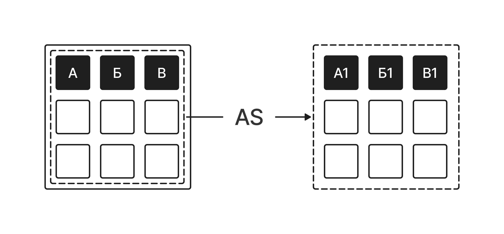

# Псевдонимы (Ключевое слово AS)

**Alias (псевдоним)** — это временное имя, которое присваивается столбцу или таблице в SQL-запросе. Псевдонимы делают итоговый отчет более понятным для человека, а сам код запроса — более компактным и удобным для чтения, особенно если оригинальные названия полей или таблиц слишком длинные.



В SQL псевдонимы создаются с помощью ключевого слова  **`AS`** .


## Псевдонимы для столбцов (Переименование полей в отчете)

Когда мы выводим данные для аналитиков или в интерфейс приложения, технические названия столбцов вроде `nickname` или `rank_title` могут выглядеть не совсем презентабельно. Мы можем переименовать их «на лету» прямо в блоке `SELECT`.

**Наш запрос:**

```sql
SELECT id AS player_id,
       nickname AS player_name,
       level AS player_level,
       rank_title AS player_rank,
       rating AS competitive_rating
FROM players;
```

**Результат (срез, первые 5 строк):**

База данных вернет привычные данные из таблицы `players`, но заголовки столбцов в итоговой таблице изменятся на те, что мы указали после `AS`:

| player\_id | player\_name  | player\_level | player\_rank | competitive\_rating |
|------------|---------------|---------------|--------------|---------------------|
| 1          | AlphaKnight   | 45            | Gold         | 2100                |
| 2          | CatQueen      | 12            | Bronze       | 850                 |
| 3          | ThunderStrike | 89            | Diamond      | 3450                |
| 4          | AliceFox      | 31            | Silver       | 1500                |
| 5          | MaxDrive      | 55            | Gold         | 2400                |

***Важно помнить:***   
Ключевое слово `AS` не меняет структуру самой таблицы в базе данных. Изменения происходят только в выводимом результате конкретного запроса.

 

## Псевдонимы для таблиц (Сокращение кода)

Если имя таблицы длинное или в будущем мы начнем связывать несколько таблиц между собой, писать каждый раз полное имя перед столбцом становится неудобно. Мы можем присвоить короткую букву-псевдоним всей таблице в блоке `FROM`.

Давай присвоим таблице `players` короткий псевдоним  **`p`** :

**Наш запрос:**

```sql
SELECT p.id,
       p.nickname AS player_name,
       p.city
FROM players AS p;
```

**Как это работает:**

Запись `players AS p` указывает SQL, что внутри этого запроса к таблице можно обращаться просто по букве `p`. Точка после псевдонима (`p.id`, `p.nickname`) явно указывает базе данных: *«Возьми поле id именно из таблицы p (players)»*. Подобный подход считается стандартом хорошего тона у разработчиков, так как он защищает код от путаницы.