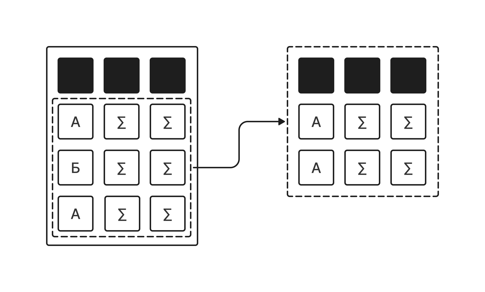

# Группировка данных (Оператор GROUP BY)

Группировка в SQL позволяет объединять строки таблицы по определенному полю или списку полей, чтобы вычислить для них общие (агрегированные) значения: сумму, среднее, максимум, минимум или количество.



Чтобы сгруппировать данные по определенному столбцу, используется ключевое слово  **`GROUP BY`** . Оно практически всегда работает в связке с **агрегатными функциями**:

- **`COUNT`**  — подсчитывает количество строк.
- **`AVG`**  — вычисляет среднее арифметическое.
- **`SUM`**  — считает сумму значений.
- **`MAX`**  — находит максимальное значение.
- **`MIN`**  — находит минимальное значение.

Давай разберем, как анализировать показатели пользователей из нашей таблицы `players` с помощью группировки.

## Среднее значение и округление (AVG, ROUND)

Представим, что разработчику нужно узнать, в каких городах живут самые опытные пользователи. Сгруппируем игроков по городам (`city`) и рассчитаем средний уровень (`level`) персонажей.

**Наш запрос:**

```sql
SELECT city,
       AVG(level) AS avg_level
FROM players
GROUP BY city;
```

**Результат (срез, первые 5 строк):**

Поскольку среднее значение часто получается дробным с длинным хвостом, результат может выглядеть неаккуратно:

| city            | avg\_level |
|-----------------|------------|
| Москва          | 43.5000    |
| Санкт-Петербург | 51.5000    |
| Новосибирск     | 89.0000    |
| Екатеринбург    | 54.0000    |
| Омск            | 55.0000    |

Чтобы привести отчет в красивый вид, используем функцию  **`ROUND`** . Она принимает два аргумента: что округлять и до скольки знаков после запятой.

**Доработаем запрос:**

```sql
SELECT city,
       ROUND(AVG(level), 1) AS avg_level
FROM players
GROUP BY city;
```

**Результат (срез, первые 5 строк):**

| city            | avg\_level |
|-----------------|------------|
| Москва          | 43.5       |
| Санкт-Петербург | 51.5       |
| Новосибирск     | 89.0       |
| Екатеринбург    | 54.0       |
| Омск            | 55.0       |

## Подсчет количества строк (COUNT)

Чтобы узнать, насколько равномерно распределена наша аудитория по игровым рангам, посчитаем количество игроков в разрезе каждого звания (`rank_title`).

**Наш запрос:**

```sql
SELECT rank_title,
       COUNT(id) AS players_count
FROM players
GROUP BY rank_title;
```

**Результат:**

| rank\_title | players\_count |
|-------------|----------------|
| Gold        | 16             |
| Bronze      | 8              |
| Diamond     | 3              |
| Silver      | 13             |
| Platinum    | 9              |
| Master      | 1              |

## Фильтрация групп (Оператор HAVING)

Что делать, если нам интересны только многочисленные ранги (например, где состоит больше 10 игроков)? Обычный оператор `WHERE` здесь не поможет, потому что он работает с отдельными строками еще до того, как они объединились в группы.

Для фильтрации уже сгруппированных данных используется оператор  **`HAVING`** .

**Наш запрос:**

```sql
SELECT rank_title,
       COUNT(id) AS players_count
FROM players
GROUP BY rank_title
HAVING COUNT(id) > 10;
```

**Результат:**

Группы с рангом `Diamond` автоматически отсеялись:

| rank\_title | players\_count |
|-------------|----------------|
| Gold        | 16             |
| Silver      | 13             |

## Сортировка сгруппированных данных

Итоговый отчет можно дополнительно отсортировать по алфавиту или по результату вычислений с помощью уже знакомого оператора `ORDER BY`, который пишется в самом конце запроса.

**Наш запрос:**

```sql
SELECT rank_title,
       COUNT(id) AS players_count
FROM players
GROUP BY rank_title
HAVING COUNT(id) > 10
ORDER BY players_count DESC;
```

**Результат:**

| rank\_title | players\_count |
|-------------|----------------|
| Gold        | 16             |
| Silver      | 13             |

## Поиск максимума и минимума (MAX, MIN)

Давай посмотрим на распределение соревновательного рейтинга (`rating`) внутри каждой гильдии (`guild`). Выведем одновременно максимальный и минимальный показатель рейтинга для каждого клана:

**Наш запрос:**

```sql
SELECT guild,
       MAX(rating) AS max_rating,
       MIN(rating) AS min_rating
FROM players
WHERE guild IS NOT NULL
GROUP BY guild;
```

**Результат:**

| guild                  | max\_rating | min\_rating |
|------------------------|-------------|-------------|
| Грифоны Эрафии         | 2800        | 1750        |
| Черные Драконы Нигона  | 3600        | 2350        |
| Золотые Единороги Авли | 2200        | 1200        |
| Церберы Инферно        | 2950        | 1600        |
| Гидры Таталии          | 2150        | 1450        |
| Громовые Птицы Крюлода | 2600        | 2500        |
| Фениксы Конфлюкса      | 3100        | 1250        |
| Древние Бегемоты       | 950         | 950         |
| Мантикоры Подземелья   | 2850        | 2750        |

## Группировка по нескольким полям

В SQL можно разделять данные на более мелкие подгруппы, указав несколько полей через запятую.

Например, давай узнаем, сколько игроков определенного уровня зарегистрировалось в конкретные дни. Сгруппируем таблицу по дате регистрации (`registration_date`) и уровню (`level`):

**Наш запрос:**

```sql
SELECT registration_date,
       level,
       COUNT(id) AS players_count
FROM players
GROUP BY registration_date,
         level;
```

**Результат (срез, первые 5 строк):**

| registration\_date | level | players\_count |
|--------------------|-------|----------------|
| 2025-01-15         | 45    | 1              |
| 2026-05-10         | 12    | 1              |
| 2024-08-22         | 89    | 1              |
| 2025-11-03         | 31    | 1              |
| 2025-03-14         | 55    | 1              |

## Разница между WHERE и HAVING: золотое правило

Главное отличие, которое нужно запомнить раз и навсегда:

**WHERE**  

Выполняет фильтрацию **ДО** группировки.  
Он отбирает отдельные строки таблицы.

**HAVING**  

Выполняет фильтрацию **ПОСЛЕ** группировки.  
Он работает с уже сформированными группами и чаще  
всего используется с агрегатными функциями.