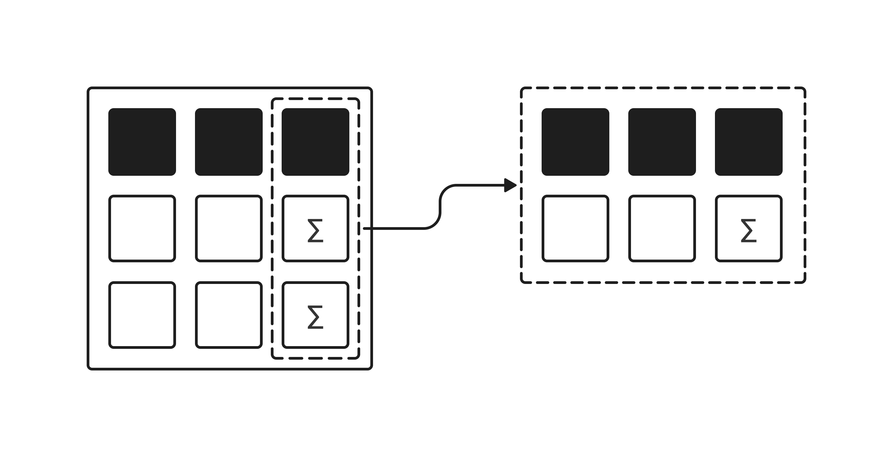

# Агрегатные функции

До этого момента мы учились выбирать отдельные строки из базы данных, фильтровать их и сортировать. Но в реальной работе аналитика или разработчика гораздо чаще возникает другая задача — получить **сводную статистику**.

Например, руководству игры неинтересно смотреть на список из 50 000 игроков по отдельности. Им нужно знать ответы на глобальные вопросы: *«Сколько всего пользователей зарегистрировано? Какой у них средний уровень? Какое максимальное количество побед набрал лучший игрок?»*

Для ответов на такие вопросы в SQL используются **агрегатные функции**.

## Что такое агрегатные функции и как они работают?

Представьте себе обычный чек из супермаркета.

Каждая строчка в нём — это отдельный товар и его цена. Это аналог обычного SQL-запроса, который выводит строки друг за другом.

А в самом низу чека всегда есть строчка, например: **«ИТОГО: 1500 рублей»**. Чтобы получить это число, кассовый аппарат взял *всю пачку строк*, сложил цены и выдал *одно единственное значение*.

Именно это и делают агрегатные функции в SQL: они берут множество значений из колонки, обрабатывают их по определенному правилу и «схлопывают» в одну-единственную строку.



Мы разберем 5 самых главных функций, которые пригодятся вам в 95% задач:

1. **COUNT** — подсчёт количества строк.
2. **SUM** — подсчёт суммы чисел.
3. **AVG** — вычисление среднего значения.
4. **MIN** — поиск самого маленького значения.
5. **MAX** — поиск самого большого значения.

Для работы мы используем нашу привычную таблицу игроков `players`.

## Функция COUNT (Количество)

Считает, сколько всего строк или записей попало в ваш запрос. Например, используется в виде `COUNT(*)`, что означает «посчитай вообще все строки».

**Пример:** Мы хотим узнать, сколько всего игроков зарегистрировано в нашей игровой базе данных.

```sql
SELECT COUNT(*) 
FROM players;
```

**Результат выполнения:**

| **COUNT(\*)** |
|---------------|
| 50            |

*(Функция вернула число 50, так как в нашей таблице сейчас ровно 50 игроков).*

## Функция SUM (Сумма)

Складывает все числа в выбранной колонке. Работает только с числовыми данными (например: уровень, рейтинг, победы).

**Пример:** Нам нужно узнать, сколько суммарно побед одержали абсолютно все участники гильдии 'Фениксы Конфлюкса'. Для этого мы объединим функцию `SUM` и уже знакомую вам фильтрацию `WHERE`:

```sql
SELECT SUM(wins) 
FROM players 
WHERE guild = 'Фениксы Конфлюкса';
```

**Результат выполнения:**

| **SUM(wins)** |
|---------------|
| 782           |

## Функция AVG (Среднее значение)

Считает среднее арифметическое всех чисел в колонке (складывает их и делит на их количество).

**Пример:** Давайте выясним, какой средний рейтинг у игроков, которые уже успели заработать почетное звание 'Gold'.

```sql
SELECT AVG(rating) 
FROM players 
WHERE rank_title = 'Gold';
```

**Результат выполнения:**

| **AVG(rating)** |
|-----------------|
| 2161.8750       |

## Функция MIN (Минимум)

Находит самое маленькое (минимальное) значение в колонке.

**Пример:** Мы хотим узнать, какой самый низкий игровой уровень среди всех зарегистрированных пользователей.

```sql
SELECT MIN(level) 
FROM players;
```

**Результат выполнения:**

| **MIN(level)** |
|----------------|
| 5              |

## Функция MAX (Максимум)

Работает противоположно предыдущей функции — находит самое большое (максимальное) значение в колонке.

**Пример:** Давайте найдем рекорд нашей игры — максимальное количество побед (`wins`), которое набрал один игрок.

```sql
SELECT MAX(wins) 
FROM players;
```

**Результат выполнения:**

| **MAX(wins)** |
|---------------|
| 620           |

Агрегатные функции вычисляют итоговое значение по набору строк и возвращают один результат на каждую группу (или один результат для всей выборки без `GROUP BY`).

`WHERE` позволяет заранее ограничить набор строк, которые попадут в вычисления, тем самым уменьшая объём данных для агрегации.